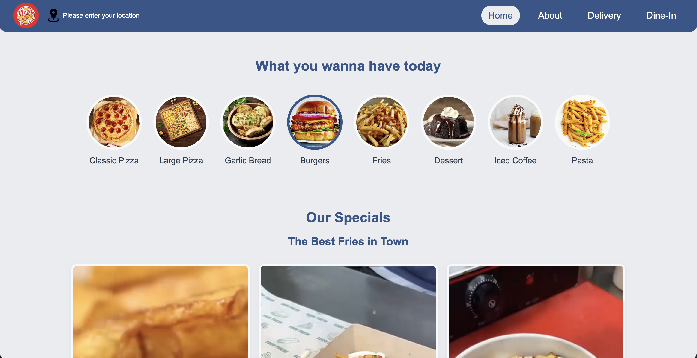
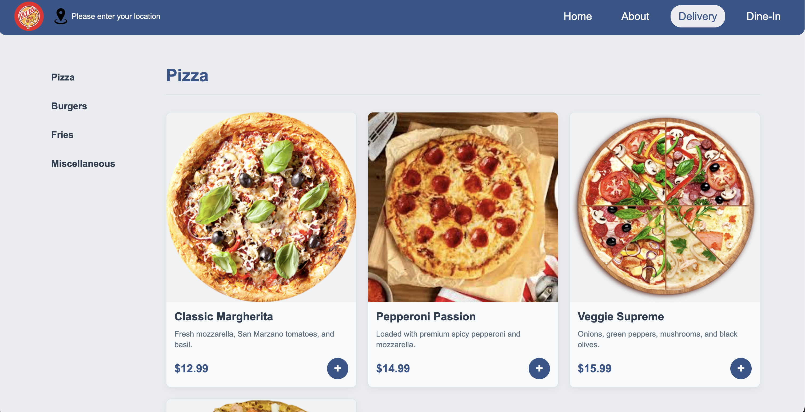
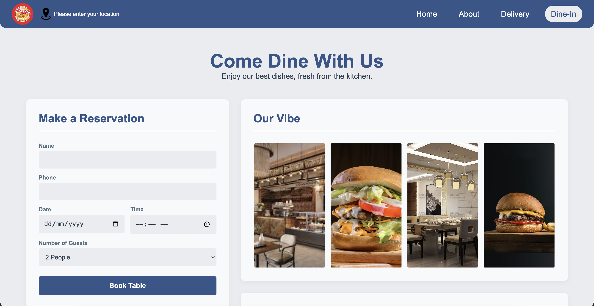
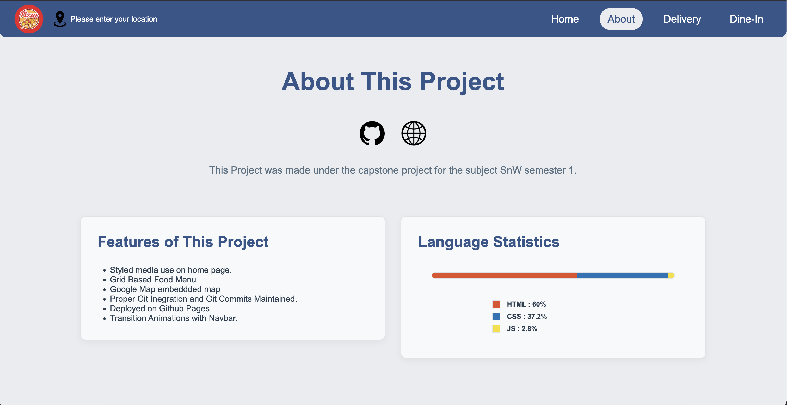

# 🍜 QuickBite

QuickBite is a responsive, multi-page website for a modern restaurant. This project was developed as a capstone project for the SnW (Semester 1) curriculum. It demonstrates a clean, modern front-end design built with pure HTML, CSS, and vanilla JavaScript, with a focus on user experience and responsive layouts.

## 🚀 Live Demo

**Check out the live deployed site:**
[**https://daksheshsharma2409.github.io/quickbite/**](https://daksheshsharma2409.github.io/quickbite/)

## 📸 Screenshots

_A few glimpses of the project._

|             Home Page             |             Order Menu             |
| :-------------------------------: | :--------------------------------: |
|  |  |

|              Dine-In Page              |             About Page              |
| :------------------------------------: | :---------------------------------: |
|  |  |

## ✨ Features

- **Multi-Page Layout:** Includes Home, About, Dine-In, and a full Order (Delivery/Takeout) menu.
- **Responsive Design:** Fully responsive layout that adapts to all screen sizes, from mobile to desktop.
- **Dynamic Home Page:** Features autoplaying videos for the "Our Specials" section to create a visually engaging experience.
- **Interactive Menu:** A grid-based, responsive food menu with "Add to Cart" buttons and a "sticky" category navigation bar.
- **CSS Animations & Effects:**
  - Rotating logo animation.
  - Smooth hover and transition effects on all cards, links, and buttons.
  - A "skeleton loader" animation that pulses while images are loading.
- **Embedded Media:** Integrates an embedded Google Map for the restaurant's location on the Dine-In page.
- **About Page:** Features a dynamic language statistics bar built with JavaScript.

## 🛠️ Tech Stack

This project is built 100% from scratch using:

- **HTML5:** For the core structure of all pages.
- **CSS3:** For all styling, layouts (Flexbox & Grid), animations, and responsiveness.
- **JavaScript (Vanilla):** For DOM manipulation on the About page (the language statistics bar).

No front-end frameworks or libraries were used.

## 🧑‍💻 About the Author

This project was built by **Dakshesh Sharma**.

- **GitHub:** [@daksheshsharma2409](https://github.com/daksheshsharma2409)
